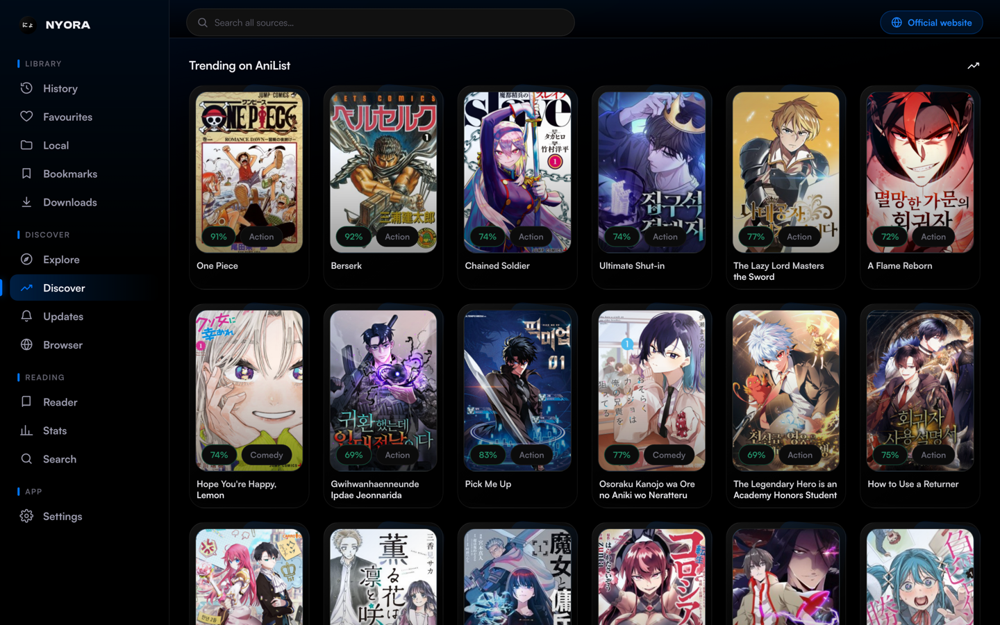
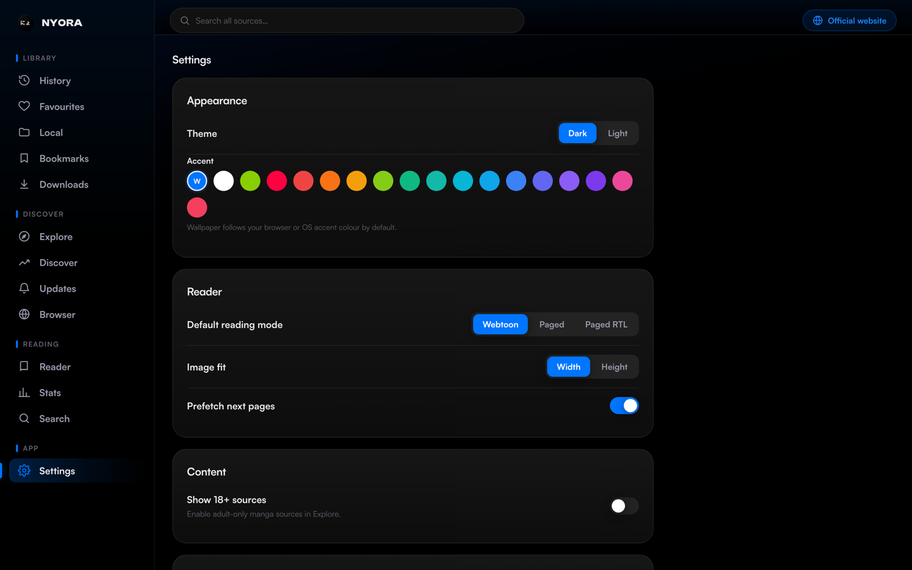
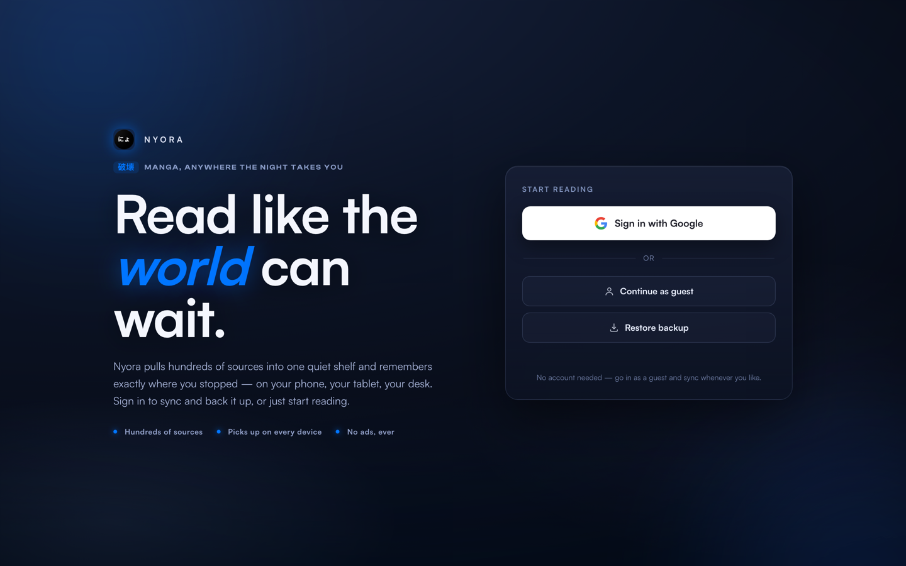
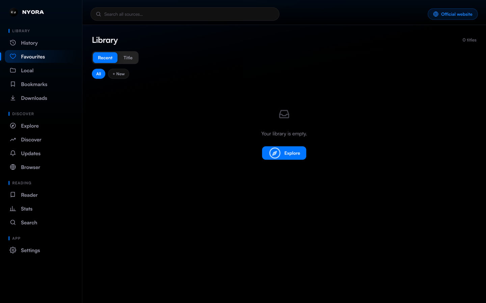

<div align="center">


# Nyora — Web

### Read like the world can wait.

A fast, free, ad-free, open-source manga reader that runs entirely in your browser — no backend, no install, no account required to start reading. The catalogue, search and page parsing all happen on your device, and the same library, history and progress sync across every Nyora platform.

<br/>

[](#tech-stack)
[](#tech-stack)
[](#tech-stack)
[](#tech-stack)
[](#tech-stack)

[](LICENSE)
[](https://github.com/Hasan72341/nyora-web/stargazers)
[](#contributing)

<br/>

[](https://nyoraweb.pages.dev)
[](https://nyora.pages.dev)

</div>

---

<div align="center">

### Mobile

| Welcome | Discover | Library | Settings |
|:-:|:-:|:-:|:-:|
|  |  |  |  |

### Desktop

| Discover | Settings |
|:-:|:-:|
|  |  |
|  |  |

</div>

---

## About

Nyora Web is the browser-native edition of Nyora — a free, ad-free, open-source manga, manhwa and manhua reader. No app store, no download, no sign-up wall: open a tab and you are reading, on a laptop, a phone, or anything with a modern browser. It is built from scratch as a **100% client-side static SPA** — the source catalogue, the search, and the parsers that turn a manga site into clean, readable pages all run on your machine. Add it to your home screen and Nyora becomes a real PWA with an offline app shell. Sign in with Google and your library and source preferences follow you to every other Nyora platform. The only server-side component is a tiny Cloudflare Worker that proxies CORS and images — everything else is just static files you can host anywhere.

## Highlights

| Pillar | What it means on Web |
|---|---|
| **Sources** | Hundreds of online sources — manga, manhwa and manhua — parsed entirely client-side, with OTA parser bundles that are SHA-256 verified and ship with bundled fallbacks. |
| **Reader** | A polished standard and webtoon reader (LTR, RTL or continuous vertical) with per-title settings, favourites in custom categories, and full reading history. |
| **Sync** | Free Google cloud sync of your library and source preferences via Supabase, plus AniList tracking driven directly from the browser. |
| **Self-host** | Deploy anywhere static — Cloudflare Pages, Netlify, your own box, a USB stick. Own your reader end to end. |
| **Open Source** | Free, ad-free, no tracking, no accounts needed to read. Apache-2.0, auditable, built from scratch. |

> Want whole-page AI translation and offline chapter downloads / CBZ? Those engines live in Nyora's native apps — grab one from the [platform table below](#nyora-on-every-platform) and your synced library comes right along.

## Table of Contents

- [About](#about)
- [Highlights](#highlights)
- [Features](#features)
  - [Sources & Discovery](#sources--discovery)
  - [Reader](#reader)
  - [Cloud Sync](#cloud-sync)
  - [Trackers](#trackers)
  - [PWA & Offline App Shell](#pwa--offline-app-shell)
  - [Self-Hosting](#self-hosting)
  - [Privacy & Open Source](#privacy--open-source)
  - [Themes & Personalisation](#themes--personalisation)
- [Capability Matrix](#capability-matrix)
- [Limitations](#limitations)
- [Screenshots](#screenshots)
- [Installation](#installation)
- [Build from Source](#build-from-source)
- [Tech Stack](#tech-stack)
- [Architecture](#architecture)
- [Nyora on Every Platform](#nyora-on-every-platform)
- [Roadmap](#roadmap)
- [FAQ](#faq)
- [Contributing](#contributing)
- [Acknowledgements](#acknowledgements)
- [License](#license)

## Features

### Sources & Discovery

Nyora Web ships with a built-in catalogue of **hundreds of online sources** spanning manga, manhwa and manhua. Browse, search and filter across them, and every source is parsed **entirely client-side** — no server scrapes on your behalf. Parser logic is delivered as JavaScript bundles loaded **over-the-air**, so source fixes ship without an app update; each bundle is **SHA-256 verified** before it executes, and the app falls back to **bundled parsers** when the network is unavailable, keeping discovery offline-first. Sources are source-compatible with Tachiyomi/Kotatsu-style definitions, but the parsing runtime here is original code written from scratch for the browser.

### Reader

The reader handles every kind of series. It supports a **standard paged mode and a webtoon mode**, with **left-to-right, right-to-left, and continuous vertical** layouts. **Per-title settings** mean each series remembers exactly how you like to read it — direction, layout and fit are stored individually rather than forced globally. Organise everything with **favourites in custom categories**, and use full **reading history** to resume precisely where you stopped. Because reading state is part of your synced library, the chapter and page you left off on are waiting for you on every other Nyora device.

### Cloud Sync

Sign in with **Google** and your **library and source preferences** follow you everywhere. Sync is implemented **per-row via Supabase** with a last-write-wins strategy, so the manga you favourited on the web is waiting on **Android, iOS, macOS, Windows and Linux** — and vice-versa. The flow is **Google Identity → Supabase Auth**, and all of it runs from the browser; there is no Nyora-operated backend storing your reading data beyond the Supabase rows tied to your account. Sync is free.

### Trackers

**AniList tracking** runs directly from the browser. Connect your AniList account and Nyora keeps your reading lists current as you progress through chapters — the tracking calls are made client-side from the app itself, with no intermediary server.

### PWA & Offline App Shell

Add Nyora to your home screen or install it from your browser and it becomes a real **Progressive Web App** with its own window, icon and launch surface. The **app shell is cached for offline use**, so the interface loads even with no connection; combined with the bundled parser fallbacks, this keeps the core experience resilient on flaky or absent networks. The install is nothing more than the same static files served over HTTPS — no native package, no separate update channel.

### Self-Hosting

Nyora Web is **just static files**, so it deploys **anywhere static** — Cloudflare Pages, Netlify, GitHub-style static hosts, your own server, or even a USB stick. The **only** server-side piece in the entire stack is a tiny **Cloudflare Worker** that proxies CORS and images for sources that don't send permissive CORS headers. Run your own reader end to end: host the SPA wherever you like and point it at your own worker. See [Build from Source](#build-from-source) for the exact commands.

### Privacy & Open Source

Nyora Web is **free, ad-free, with no tracking, and no account needed to read**. It is licensed under **Apache-2.0** with fully auditable code, built from scratch. There is no telemetry pipeline and no advertising SDK — the app only talks to the manga sources you browse, the optional Cloudflare proxy, and (if you sign in) Supabase for sync and AniList for tracking. Community **issues and pull requests are welcome**.

### Themes & Personalisation

Beyond per-title reading settings, Nyora Web exposes its appearance and behaviour through the in-app **Settings** screen (shown in the screenshots above), letting you tailor the reader and library experience to your taste. Because preferences are part of the synced profile, the choices you make carry across devices when you are signed in.

## Capability Matrix

What the browser edition does and does not do, at a glance. "—" means the capability lives in Nyora's native apps rather than the web client.

| Capability | Nyora Web |
|---|---|
| Hundreds of client-side sources | ✓ |
| OTA parser bundles (SHA-256 verified, bundled fallback) | ✓ |
| Standard + webtoon reader (LTR / RTL / vertical) | ✓ |
| Per-title reading settings | ✓ |
| Favourites in custom categories + reading history | ✓ |
| Google cloud sync (library + source preferences) | ✓ |
| AniList tracking | ✓ |
| Installable PWA + offline app shell | ✓ |
| Self-hostable (static host + Cloudflare Worker) | ✓ |
| No account required to read | ✓ |
| Whole-page AI translation | — *(native apps)* |
| Offline chapter downloads / CBZ export | — *(native apps)* |

## Limitations

Nyora Web is deliberately a pure client-side reader. Honest constraints to know before you rely on it:

- **No AI page translation.** Whole-page OCR + translation is not part of the web client; it lives in Nyora's native apps. Sign in with the same Google account there and your web library carries over.
- **No chapter downloads beyond the app shell.** Offline support means the cached PWA app shell and bundled parser fallbacks — not saved chapters. There is no per-chapter download or CBZ export in the browser; use a native app for true offline reading.
- **Some sources need the proxy.** Manga sites frequently omit CORS headers, so HTML and images for those sources route through the Cloudflare Worker. The app always tries a direct fetch first and only falls back to the worker when required.
- **Google sign-in is origin-bound.** When self-hosting locally, sign-in only works on the registered origin `127.0.0.1:3000`; other origins (for example `localhost`) are rejected by the sign-in flow.

## Screenshots

### Mobile

| Welcome | Discover | Library | Settings |
|:-:|:-:|:-:|:-:|
|  |  |  |  |

### Desktop

| Discover | Settings |
|:-:|:-:|
|  |  |
|  |  |

## Installation

There is nothing to install to start reading.

### Use it instantly

Just open **[nyoraweb.pages.dev](https://nyoraweb.pages.dev)** in any modern browser. Sign in with Google to sync your library, history and source preferences with your other Nyora devices. No account is required if you only want to read.

### Install as a PWA

To get a native-feeling install with its own window and home-screen icon:

- **Desktop (Chrome / Edge):** open [nyoraweb.pages.dev](https://nyoraweb.pages.dev), then use the install icon in the address bar (or the browser menu → *Install Nyora*).
- **Android (Chrome):** open the app, then menu → *Add to Home screen* / *Install app*.
- **iOS / iPadOS (Safari):** open the app, tap the Share button, then *Add to Home Screen*.

Once installed, the cached app shell lets the interface load even when you are offline.

### Requirements

A current version of any major browser (Chromium-based, Firefox, or Safari) with JavaScript enabled. Google sign-in is only needed for cross-device sync; AniList tracking only when you connect it.

### Troubleshooting

- **Google sign-in fails when self-hosting locally.** Use the origin `127.0.0.1:3000` — that is the origin registered for Google sign-in. Other origins (for example `localhost`) will not be accepted by the sign-in flow.
- **A source won't load images or pages.** Manga sites frequently omit CORS headers; the app tries a direct fetch first and only then routes through the Cloudflare proxy. If you are self-hosting, make sure your worker is deployed and reachable (see below).
- **A parser looks broken.** Parser bundles are loaded OTA and SHA-256 verified; if verification or the network fails, the app falls back to the bundled parser. Reloading the app picks up the latest verified bundle.

## Build from Source

Nyora Web is static — you can serve the `web/` directory with anything.

### Prerequisites

- Python 3 (for the simple dev server below) **or** any static file server.
- Node.js with `npx` available, only if you want to deploy the Cloudflare Worker.

### Run the SPA locally

```bash
cd web && python3 -m http.server 3000   # → http://127.0.0.1:3000
```

Use `127.0.0.1:3000` (the origin registered for Google sign-in). Any static host works in production — Cloudflare Pages, Netlify, and similar.

### Deploy the CORS / image proxy

The CORS and image proxy is a Cloudflare Worker in `cloudflare-worker/`:

```bash
npx wrangler deploy
```

This is the **only** server-side component. The SPA tries direct fetches first and falls back to the worker for sources that don't send CORS headers.

## Tech Stack

[](#tech-stack)
[](#tech-stack)
[](#tech-stack)
[](#tech-stack)
[](#tech-stack)

- **TypeScript / JavaScript** — the entire SPA, including the in-browser parser runtime, is plain client-side JavaScript/TypeScript with no build-time backend.
- **PWA** — an installable Progressive Web App with a cached, offline-capable app shell.
- **Cloudflare** — a single small Cloudflare Worker proxies CORS and images; the SPA itself deploys cleanly to Cloudflare Pages or any static host.
- **Supabase** — provides authentication (via Google Identity) and per-row library and source-preference sync.

## Architecture

```
web/                  ← the SPA (deployed)
  core/               ← api · parser-runtime · sync · ui · library · store
cloudflare-worker/    ← CORS / image proxy (worker.js)
```

- **Parsing runs in-browser.** `core/parser-runtime.js` loads JS parser bundles OTA (SHA-256 verified, with bundled fallback) and executes them client-side. No server scrapes on your behalf.
- **CORS bypass is the Cloudflare worker.** Manga sites typically don't send CORS headers, so HTML and images are fetched through `<proxy>/proxy?url=…` and `<proxy>/image?u=…` (the latter adds the source `Referer`/`UA`). The app always tries a direct fetch first and only falls back to the worker when needed.
- **Account sync is client-side.** The flow is Google Identity → Supabase Auth → per-row library and source-preference sync, using last-write-wins. There is no Nyora-operated backend beyond the proxy worker and your Supabase rows.

## Nyora on Every Platform

| Platform | Repo | Get it |
|---|---|---|
| Web | **nyora-web** *(you are here)* | [nyoraweb.pages.dev](https://nyoraweb.pages.dev) |
| Android | [nyora-android](https://github.com/Hasan72341/nyora-android) | [APK](https://github.com/Hasan72341/nyora-android/releases/latest) |
| Windows | [nyora-windows](https://github.com/Hasan72341/nyora-windows) | [.exe (x64/ARM64)](https://github.com/Hasan72341/nyora-windows/releases/latest) |
| macOS | [nyora-mac](https://github.com/Hasan72341/nyora-mac) | [.dmg / `brew`](https://github.com/Hasan72341/nyora-mac/releases/latest) |
| Linux | [nyora-linux](https://github.com/Hasan72341/nyora-linux) | [deb · rpm · curl](https://github.com/Hasan72341/nyora-linux/releases/latest) |
| iOS / iPadOS | [nyora-ios](https://github.com/Hasan72341/nyora-ios) | [sideload IPA](https://github.com/Hasan72341/nyora-ios/releases/latest) |

## Roadmap

No dates, no promises — just the honest direction.

- **Broader source parity.** Ongoing work expanding and hardening the OTA parser catalogue so newer and trickier sources keep up across platforms.
- **Native-app companions.** Whole-page AI translation and offline downloads stay in Nyora's native apps; the cross-platform [iOS](https://github.com/Hasan72341/nyora-ios) build has a signed TestFlight release planned to follow. Your synced web library comes along to all of them.

## FAQ

**Is Nyora Web free?**
Yes. It is free, ad-free, with no tracking, and no account is required to read.

**Are there any ads or trackers?**
No. There is no advertising SDK and no telemetry. The app only communicates with the sources you browse, the optional Cloudflare proxy, and — if you choose to sign in — Supabase for sync and AniList for tracking.

**Where does the content come from, and is that legal?**
Nyora does not host any manga. It parses publicly available online sources entirely client-side, much like a browser does. Nyora is not affiliated with any of the sources it can access.

**Is my sync data private?**
Sync uses Supabase with Google sign-in, storing your library and source preferences per-row against your account. Nyora does not run a separate backend collecting your reading activity, and there is no telemetry. Sign-in is entirely optional and only enables cross-device sync.

**Does it work offline?**
The PWA app shell is cached for offline use, and parser bundles ship with bundled fallbacks, so the interface and discovery remain resilient without a connection. There are no offline chapter downloads in the browser — for full offline reading and CBZ export, use one of Nyora's native apps from the platform table above; your synced library comes with you.

**Can I self-host it?**
Absolutely. The SPA is just static files you can serve from any static host, and the only server-side piece is a small Cloudflare Worker for the CORS/image proxy. See [Build from Source](#build-from-source).

**How do I get AI translation and offline downloads?**
Those engines live in Nyora's native apps. Install one from the [platform table](#nyora-on-every-platform), sign in with the same Google account, and your web library syncs straight over.

**How do I update the web app?**
Just reload it. As a deployed static SPA, the latest version is served on each visit; parser bundles update over-the-air independently and are SHA-256 verified before they run.

## Contributing

Issues and pull requests are welcome — bug reports, new sources, reader polish, all of it. If you're planning a larger change, open an issue first so we can discuss the approach before you invest the work. The codebase is original and auditable, and the in-browser architecture means most fixes are plain client-side JavaScript. If Nyora makes your reading better, starring the [repository](https://github.com/Hasan72341/nyora-web/stargazers) is the simplest way to help the project reach more readers.

## Acknowledgements

Nyora's sources are source-compatible with Tachiyomi/Kotatsu-style definitions, and the project owes thanks to the broader open-source manga-reader community whose ecosystems made that compatibility possible. Thanks also to the maintainers of the libraries and platforms Nyora Web builds on — Supabase for auth and sync, and Cloudflare for the proxy and static hosting — and to everyone who reports issues and contributes fixes.

## License

Licensed under the **Apache License 2.0** (see [`LICENSE`](LICENSE)). Original code, built from scratch — source-compatible with Tachiyomi/Kotatsu-style sources but not a fork.

Developed and maintained by **Md Hasan Raza** — [GitHub](https://github.com/Hasan72341) · [Instagram](https://instagram.com/md_hasan_raza____) · [LinkedIn](https://www.linkedin.com/in/md-hasan-raza) · hasanraza96@outlook.com

> Nyora is not affiliated with any of the manga sources it can access.