<div align="center">


# Nyora — Web

### Read like the world can wait.

A fast, free, ad-free, open-source manga reader that runs in your browser — no install, no account required to start reading. It reads through the shared **Nyora helper** (the Kotatsu parser engine), and the same library, history and progress sync across every Nyora platform.

<br/>

[](#tech-stack)
[](#tech-stack)
[](#tech-stack)
[](#tech-stack)

[](LICENSE)
[](https://github.com/Nyora-Manga/nyora-web/stargazers)
[](#contributing)

<br/>

[](https://web.nyora.xyz)
[](https://nyora.xyz)

<br/>

**No download. No sign-up. Just open the link and read.**
Open-source and auditable · no ads · no tracking · your library stays yours.

</div>

---

<div align="center">

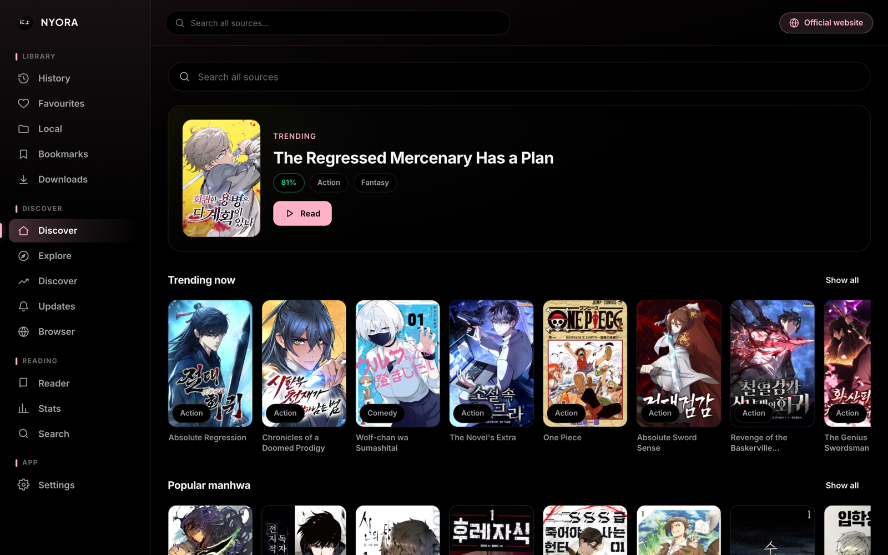

<em>Discover on desktop — real content, straight from the browser. More below: <a href="#screenshots">light & dark, phone · tablet · desktop</a>.</em>

</div>

---

## About

Nyora Web is the browser-native edition of Nyora — a free, ad-free, open-source manga, manhwa and manhua reader. No app store, no download, no sign-up wall: open a tab and you are reading, on a laptop, a phone, or anything with a modern browser. It is a lightweight **browser client over the Nyora helper** — the same [Kotatsu](https://github.com/KotatsuApp/kotatsu-parsers) parser engine (`api.nyora.xyz`) that powers every Nyora platform — so the source catalogue, search and reading stay current with **no scraper to maintain in the browser**. The UI, your library and reading state run on your device. Add it to your home screen and Nyora becomes a real PWA with an offline app shell. Create a free Nyora Cloud account with an email and password and your library and source preferences follow you to every other Nyora platform. The server-side pieces are the shared **Nyora helper** (used by every platform — it also sends permissive CORS and proxies images), and — only if you sign in — the Nyora Cloud sync backend; the app itself is just static files you can host anywhere.

## Why you'll love it

- **Nothing to install.** It's a website. Click the link and you're reading in seconds — no store, no APK, no Gatekeeper prompt. Want an app icon? Add it to your home screen and it behaves like a native app.
- **No ads, ever. No tracking, ever.** There is no advertising SDK and no telemetry pipeline anywhere in the code. The app talks only to the Nyora helper (for source content and images), and — only if *you* sign in — Nyora Cloud for sync.
- **No account to read.** Open the app and start. Sign-in is entirely optional and exists for one reason: syncing your library across your devices.
- **Your library is yours.** Reading state lives on your device, and — if you sign in — in your own account on Nyora Cloud, a self-hosted sync backend. Nothing else about what you read is collected.
- **Auditable and yours to keep.** Apache-2.0, original code, built from scratch. You can read every line, fork it, or self-host the whole thing — even off a USB stick.
- **One library, every screen.** Favourite something on the web and it's waiting on Android, iOS, macOS, Windows and Linux, on the same chapter and page you left off.

## Highlights

| Pillar | What it means on Web |
|---|---|
| **Sources** | Hundreds of live, health-checked sources — manga, manhwa and manhua — served by the **Nyora helper** (the Kotatsu parser engine). The web helper runs on a shared server, so Cloudflare-walled / dead sources are filtered out (~390 of the ~960 catalogue); the **full ~960** is available in the native apps, which parse on-device. |
| **Reader** | A polished standard and webtoon reader (LTR, RTL or continuous vertical) with per-title settings, favourites in custom categories, and full reading history. |
| **Sync** | Free Nyora Cloud sync of your library and source preferences via an email + password account, plus AniList tracking driven directly from the browser. |
| **Self-host** | Deploy anywhere static — a plain web server, your own box, a USB stick. Own your reader end to end. |
| **Open Source** | Free, ad-free, no tracking, no accounts needed to read. Apache-2.0, auditable, built from scratch. |

> Want whole-page AI translation and offline chapter downloads / CBZ? Those engines live in Nyora's native apps — grab one from the [platform table below](#nyora-on-every-platform) and your synced library comes right along.

## Table of Contents

- [About](#about)
- [Why you'll love it](#why-youll-love-it)
- [Highlights](#highlights)
- [Features](#features)
  - [Sources & Discovery](#sources--discovery)
  - [Reader](#reader)
  - [Cloud Sync](#cloud-sync)
  - [Trackers](#trackers)
  - [PWA & Offline App Shell](#pwa--offline-app-shell)
  - [Self-Hosting](#self-hosting)
  - [Privacy & Open Source](#privacy--open-source)
  - [Themes & Personalisation](#themes--personalisation)
- [Capability Matrix](#capability-matrix)
- [Limitations](#limitations)
- [Screenshots](#screenshots)
- [Installation](#installation)
- [Build from Source](#build-from-source)
- [Tech Stack](#tech-stack)
- [Architecture](#architecture)
- [Nyora on Every Platform](#nyora-on-every-platform)
- [Roadmap](#roadmap)
- [FAQ](#faq)
- [Contributing](#contributing)
  - [Ways to contribute](#ways-to-contribute)
  - [Development setup](#development-setup)
  - [Project structure](#project-structure)
  - [Good first contributions](#good-first-contributions)
  - [Adding a source](#adding-a-source)
  - [Pull request & issue etiquette](#pull-request--issue-etiquette)
- [Acknowledgements](#acknowledgements)
- [License](#license)

## Features

### Sources & Discovery

Nyora Web reads through the **Nyora helper** — the [Kotatsu](https://github.com/KotatsuApp/kotatsu-parsers) engine at `api.nyora.xyz`, the same content backend the native apps and SDKs use — so sources stay current without shipping fragile scrapers to the browser. Because the web helper runs on a **shared server** (a datacenter IP), sources that only serve a real browser or residential IP — the **Cloudflare-walled** ones — plus dead upstreams are **filtered out**, leaving **hundreds of live, health-checked sources** (currently ~390 of the ~960-source catalogue). The **full ~960 catalogue is available in the native apps**, which parse on your device (and use a device relay) to reach the Cloudflare-walled sources a hosted server can't. (A dormant in-browser parser fallback ships for offline resilience but is not the primary path.)

### Reader

The reader handles every kind of series. It supports a **standard paged mode and a webtoon mode**, with **left-to-right, right-to-left, and continuous vertical** layouts. **Per-title settings** mean each series remembers exactly how you like to read it — direction, layout and fit are stored individually rather than forced globally. Organise everything with **favourites in custom categories**, and use full **reading history** to resume precisely where you stopped. Because reading state is part of your synced library, the chapter and page you left off on are waiting for you on every other Nyora device.

### Cloud Sync

Create a free **Nyora Cloud** account with an **email and password** and your **library and source preferences** follow you everywhere. Sync is implemented **per-row** with a last-write-wins strategy, so the manga you favourited on the web is waiting on **Android, iOS, macOS, Windows and Linux** — and vice-versa. Accounts run on **Nyora Cloud**, a self-hosted FastAPI backend (OAuth2 password flow + JWT) at `sync.nyora.xyz`; it stores only the reading data tied to your account. Sync is free.

### Trackers

**AniList tracking** runs directly from the browser. Connect your AniList account and Nyora keeps your reading lists current as you progress through chapters — the tracking calls are made client-side from the app itself, with no intermediary server.

### PWA & Offline App Shell

Add Nyora to your home screen or install it from your browser and it becomes a real **Progressive Web App** with its own window, icon and launch surface. The **app shell is cached for offline use**, so the interface loads even with no connection; combined with the bundled parser fallbacks, this keeps the core experience resilient on flaky or absent networks. The install is nothing more than the same static files served over HTTPS — no native package, no separate update channel.

### Self-Hosting

Nyora Web is **just static files**, so it deploys **anywhere static** — a plain web server, Cloudflare Pages, GitHub-style static hosts, your own box, or even a USB stick. The one server-side dependency is the **Nyora helper** (`api.nyora.xyz`) — it serves the source content, sends permissive CORS, and proxies cover/page images through its own `/image` endpoint, so the browser talks only to the helper and needs no separate CORS proxy. Point the SPA at your own helper and you own the reader end to end. See [Build from Source](#build-from-source) for the exact commands.

Prefer a **one-command, fully-local Docker deployment** — the SPA plus a bundled parser **helper** in one container, with no Cloudflare Worker to run? Use **[nyora-selfhost](https://github.com/Nyora-Manga/nyora-selfhost)**: `docker compose up` and open `localhost:8080`.

### Privacy & Open Source

Nyora Web is **free, ad-free, with no tracking, and no account needed to read**. It is licensed under **Apache-2.0** with fully auditable code, built from scratch. There is no telemetry pipeline and no advertising SDK — the app only talks to the Nyora helper (for source content and images), and (if you sign in) Nyora Cloud for sync and AniList for tracking. Community **issues and pull requests are welcome**.

### Themes & Personalisation

Beyond per-title reading settings, Nyora Web exposes its appearance and behaviour through the in-app **Settings** screen (shown in the screenshots above), letting you tailor the reader and library experience to your taste. Because preferences are part of the synced profile, the choices you make carry across devices when you are signed in.

## Capability Matrix

What the browser edition does and does not do, at a glance. "—" means the capability lives in Nyora's native apps rather than the web client.

| Capability | Nyora Web |
|---|---|
| Hundreds of live sources via the Nyora helper (Kotatsu engine) | ✓ |
| Full ~960-source catalogue (Cloudflare-walled sources included) | — |
| Same content backend as the native apps & SDKs | ✓ |
| Standard + webtoon reader (LTR / RTL / vertical) | ✓ |
| Per-title reading settings | ✓ |
| Favourites in custom categories + reading history | ✓ |
| Nyora Cloud sync (library + source preferences) | ✓ |
| AniList tracking | ✓ |
| Installable PWA + offline app shell | ✓ |
| Self-hostable (static host + your own Nyora helper) | ✓ |
| No account required to read | ✓ |
| Whole-page AI translation | — *(native apps)* |
| Offline chapter downloads / CBZ export | — *(native apps)* |

## Limitations

Nyora Web is deliberately a pure client-side reader. Honest constraints to know before you rely on it:

- **No AI page translation.** Whole-page OCR + translation is not part of the web client; it lives in Nyora's native apps. Sign in with the same Nyora Cloud account there and your web library carries over.
- **No chapter downloads beyond the app shell.** Offline support means the cached PWA app shell — not saved chapters. There is no per-chapter download or CBZ export in the browser; use a native app for true offline reading.
- **Not every source works on the web.** The hosted web helper runs on a shared server (a datacenter IP), so **Cloudflare-walled** sources — the ones that only answer a real browser or residential IP — and dead upstreams are filtered out. The web shows the **live, health-checked subset** (~390 of the ~960-source catalogue). The **full ~960** is reachable in the **native apps**, which parse on your own device (and use a device relay) to get past Cloudflare. Same account, same library — just more sources on native.
- **CORS and images go through the helper.** Manga sites frequently omit CORS headers and hotlink-protect their images, so the **Nyora helper** fetches them server-side and re-serves them with permissive CORS (via its `/image` endpoint). The browser only ever talks to the helper — no separate CORS proxy is involved.
- **Sign-in is email + password.** Nyora Cloud accounts use an email and password (no Google OAuth), so sign-in is not tied to a registered origin and works wherever the app is served.

## Screenshots

Real screenshots from the app — both **light and dark** themes, responsive across **phone, tablet and desktop**. The same UI adapts from a floating bottom nav on a phone to a full sidebar on a tablet or desktop.

### Desktop

| Discover | Explore sources |
|:-:|:-:|
|  | 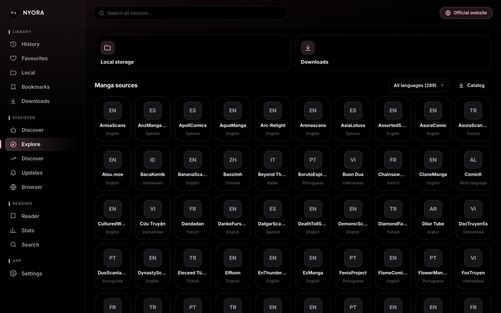 |
| **Discover** — trending & popular rails on load. | **Explore** — hundreds of live sources by language. |

| Title & chapters | Global search |
|:-:|:-:|
| 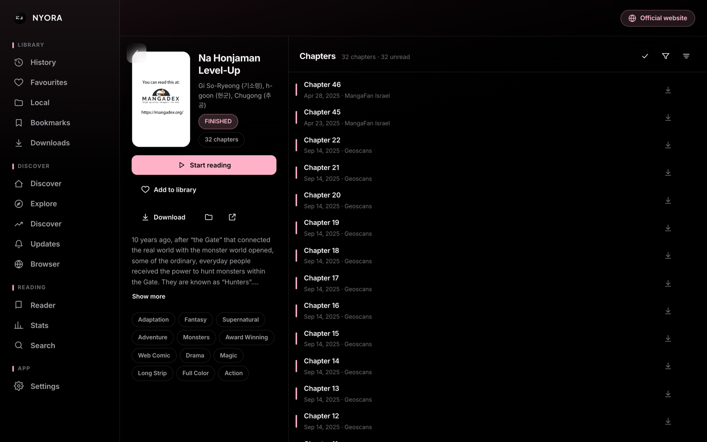 | 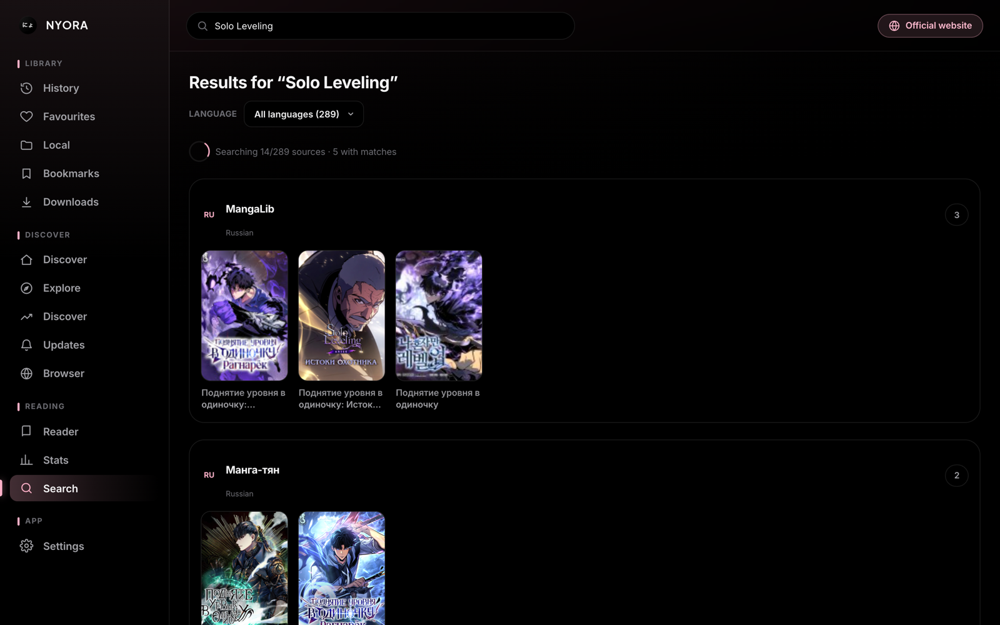 |
| **Details** — description, tags, full chapter list. | **Search** — one query across all your sources. |

<details>
<summary><b>Light theme &amp; more</b></summary>

| Discover — light | Settings — light |
|:-:|:-:|
| 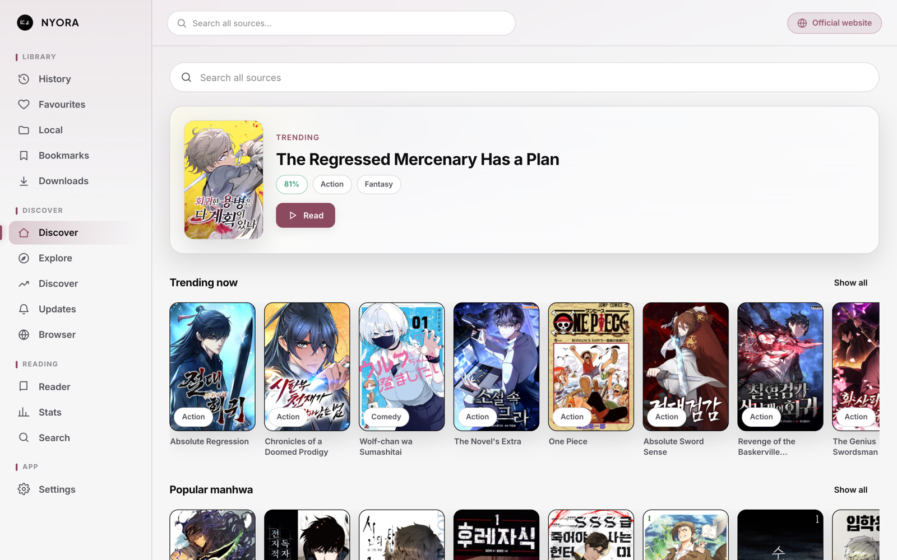 | 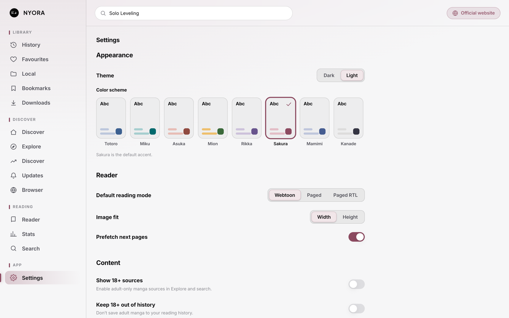 |

| Settings — dark | Welcome / onboarding |
|:-:|:-:|
| 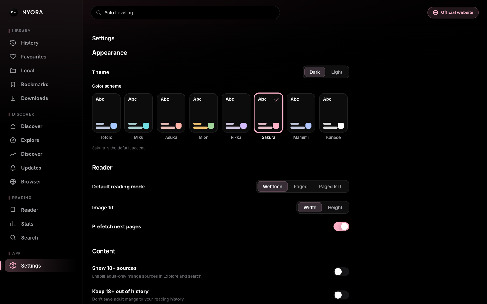 | 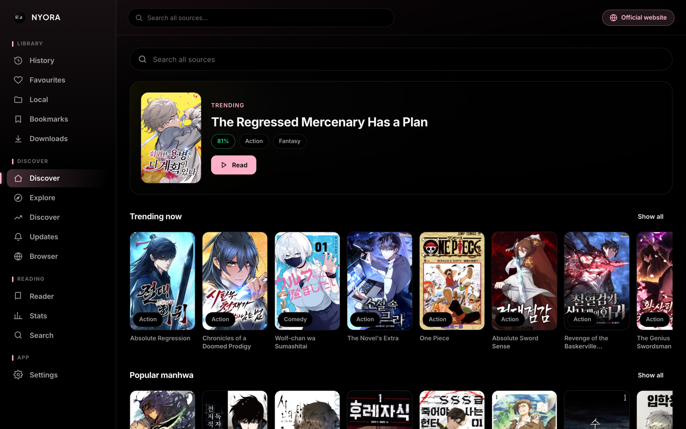 |

</details>

### Tablet

| Discover | Explore |
|:-:|:-:|
| 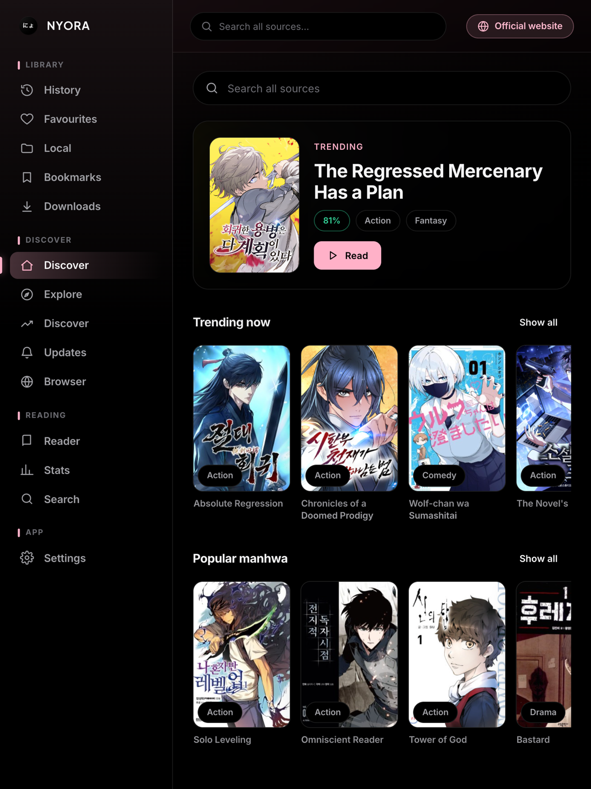 | 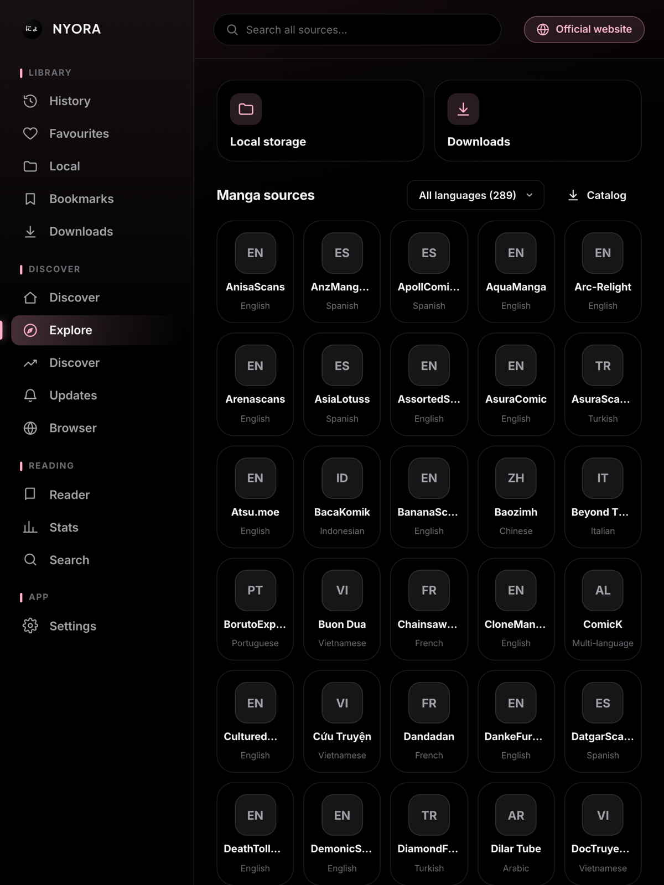 |

| Search | Settings |
|:-:|:-:|
| 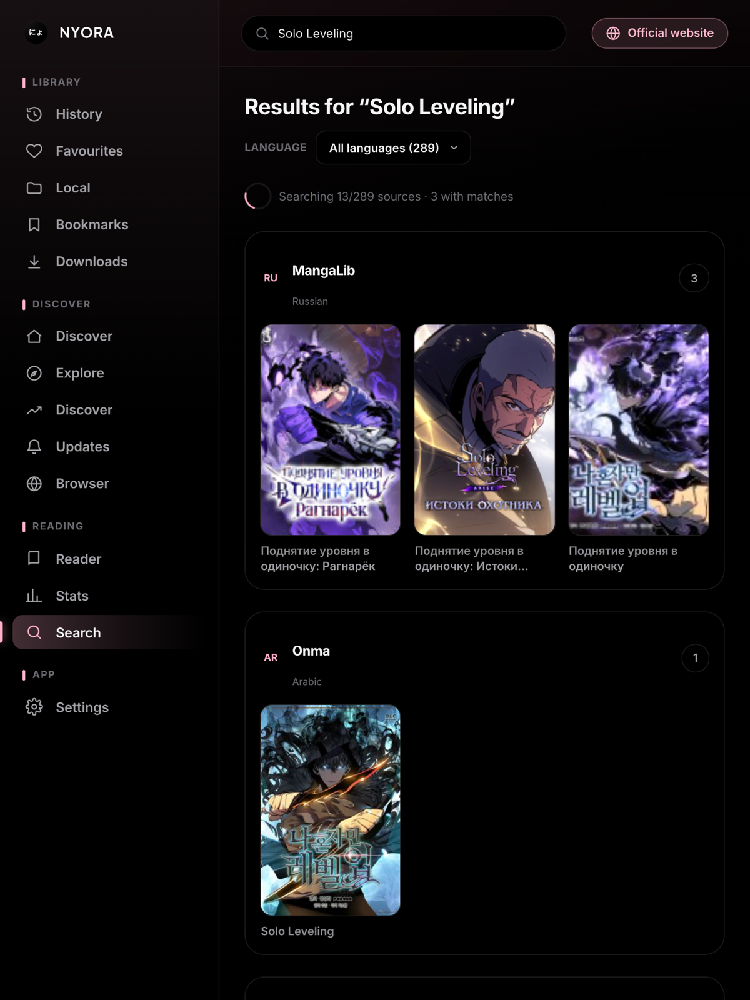 | 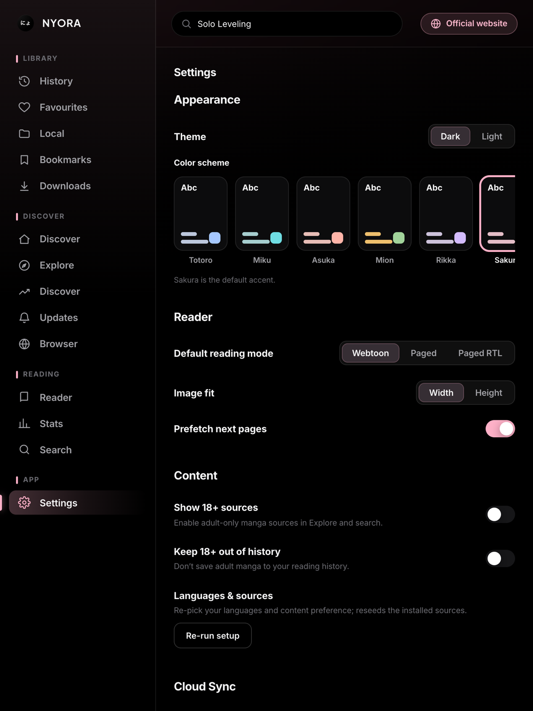 |

### Mobile

| Discover | Explore | Reader |
|:-:|:-:|:-:|
| 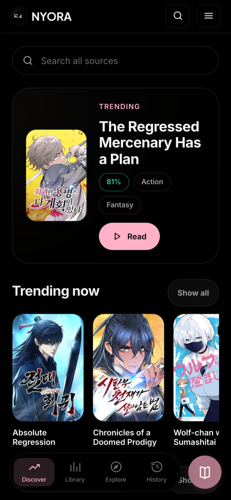 | 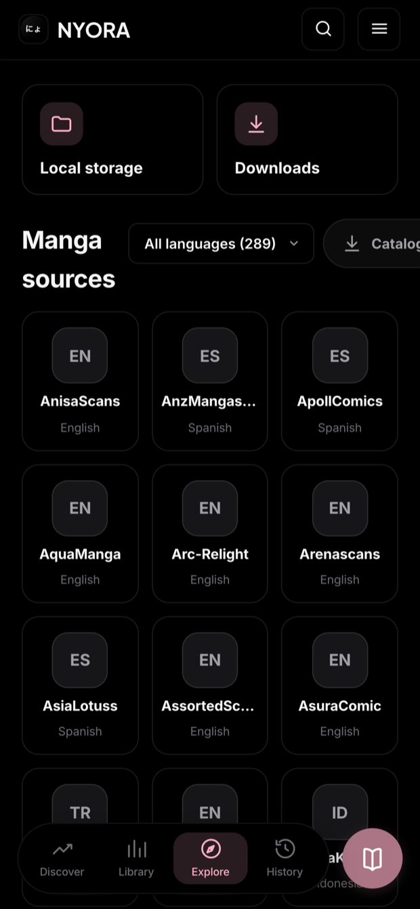 | 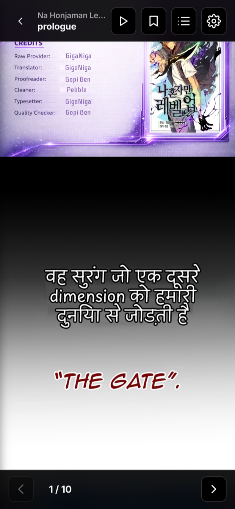 |
| **Discover** | **Explore** | **Reader** — immersive webtoon/paged |

| Welcome | Search | Settings | Discover — light |
|:-:|:-:|:-:|:-:|
|  | 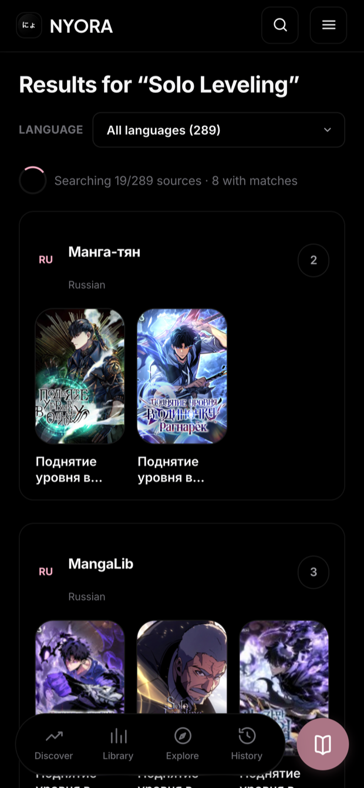 | 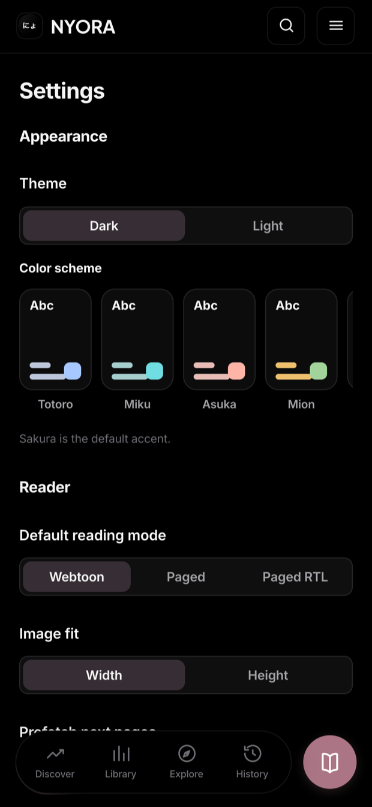 | 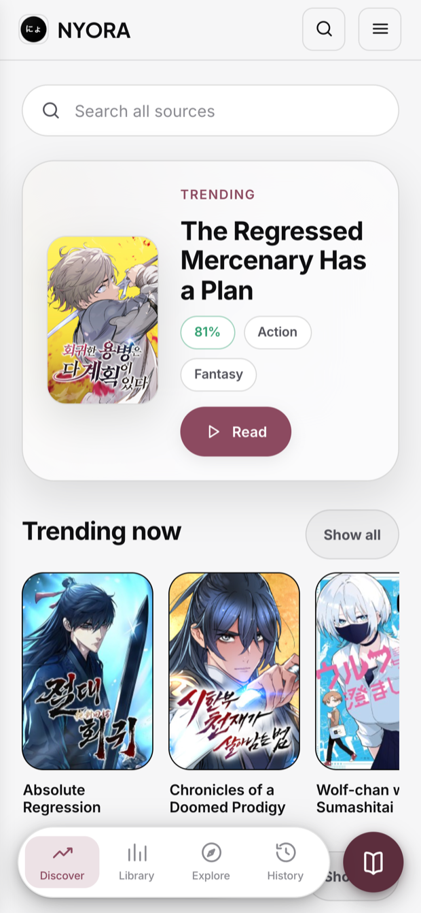 |

## Installation

There is nothing to install to start reading. This is the lowest-friction way to read manga of any Nyora edition — no store account, no APK, no Gatekeeper warning. Because it's open-source, you can audit exactly what it does before you trust it.

### Use it instantly

Just open **[web.nyora.xyz](https://web.nyora.xyz)** in any modern browser. That's the whole install. Create a free Nyora Cloud account (email + password) to sync your library, history and source preferences with your other Nyora devices — **no account is required if you only want to read.**

### Install as a PWA

Want a real app icon, its own window, and offline launch? Add Nyora to your device. This is the same static files served over HTTPS — there is no separate native package and no extra update channel, so there are no scary permission prompts to approve.

- **Desktop (Chrome / Edge):** open [web.nyora.xyz](https://web.nyora.xyz), then use the install icon in the address bar (or the browser menu → *Install Nyora*).
- **Android (Chrome):** open the app, then menu → *Add to Home screen* / *Install app*.
- **iOS / iPadOS (Safari):** open the app, tap the Share button, then *Add to Home Screen*.

Once installed, the cached app shell lets the interface load even when you are offline.

### Is this safe to use?

Yes. A few reassurances, in plain terms:

- **It's open-source and auditable.** Every line is on [GitHub](https://github.com/Nyora-Manga/nyora-web) under Apache-2.0. Nothing is hidden, obfuscated or phoning home.
- **No ads, no trackers, no telemetry.** There is no advertising SDK and no analytics pipeline in the code.
- **No account needed to read**, and the only data ever stored on a server is the sync rows tied to *your* Nyora Cloud account — and only if you choose to sign in.
- **It runs in your browser's sandbox.** Unlike a downloaded app, a website can't touch your files or system; it just renders pages. If you ever want to stop using it, close the tab — there's nothing left behind to uninstall (and a PWA install removes cleanly like any bookmark/app).

### Requirements

A current version of any major browser (Chromium-based, Firefox, or Safari) with JavaScript enabled. A Nyora Cloud account (email + password) is only needed for cross-device sync; AniList tracking only when you connect it.

### Troubleshooting

- **Self-hosting sign-in.** Sign-in is email + password against Nyora Cloud and is not origin-bound; just make sure your build can reach `sync.nyora.xyz`.
- **A source won't load images or pages.** Manga sites frequently omit CORS headers; the app tries a direct fetch first and only then routes through the Cloudflare proxy. If you are self-hosting, make sure your worker is deployed and reachable (see below).
- **A source looks broken.** Sources are served by the Nyora helper, so fixes ship server-side with no app update — just reload. (A dormant in-browser parser fallback ships for offline resilience.)

## Build from Source

Nyora Web is static — you can serve the `web/` directory with anything.

### Prerequisites

- Python 3 (for the simple dev server below) **or** any static file server.
- Node.js — only if you want to produce the bundled `dist/` build (`npm run build`).

### Run the SPA locally

```bash
cd web && python3 -m http.server 3000   # → http://127.0.0.1:3000
```

Use `127.0.0.1:3000` for local development. Any static host works in production — a plain web server, Cloudflare Pages, and similar.

### Point it at a helper

The SPA reads all content and images from the **Nyora helper**, configured in `web/env.js` (`NYORA_HELPER_URL`, default `https://api.nyora.xyz`). The helper handles CORS and the `/image` proxy, so **there is no separate proxy to deploy**. To self-host the helper itself, see [`nyora-selfhost`](https://github.com/Nyora-Manga/nyora-selfhost) (SPA + bundled helper in one container).

## Tech Stack

[](#tech-stack)
[](#tech-stack)
[](#tech-stack)
[](#tech-stack)

- **TypeScript / JavaScript** — the entire SPA is plain client-side JavaScript/TypeScript (no framework), reading content from the Nyora helper over REST; a dormant in-browser parser runtime ships as an offline fallback.
- **PWA** — an installable Progressive Web App with a cached, offline-capable app shell.
- **Nyora helper** — the Kotatsu parser engine over REST (`api.nyora.xyz`); it serves source content, sends permissive CORS, and proxies images via `/image`, so the SPA needs no separate CORS proxy.
- **Nyora Cloud** — a self-hosted FastAPI backend providing email + password authentication (OAuth2 + JWT) and per-row library and source-preference sync.

## Architecture

```
web/                  ← the SPA (deployed)
  core/               ← api · parser-runtime · sync · ui · library · store
```

- **Content via the Nyora helper.** `core/api.js` reads the catalogue, search, details and pages from the Nyora helper (the Kotatsu engine). `core/parser-runtime.js` + `web-parsers/` remain as a dormant client-side fallback for offline resilience.
- **CORS + images come from the helper.** Manga sites typically don't send CORS headers and hotlink-protect their images, so the Nyora helper fetches them server-side and re-serves them with permissive CORS via `<helper>/image?u=…` (adding the source `Referer`/`UA`). The browser talks only to the helper — there is no separate CORS proxy.
- **Account sync is client-side.** The flow is email + password → Nyora Cloud (OAuth2 + JWT) → per-row library and source-preference sync, using last-write-wins. The only server pieces are the Nyora helper and — if you sign in — your Nyora Cloud account.

## Nyora on Every Platform

| Platform | Repo | Get it |
|---|---|---|
| Web | **nyora-web** *(you are here)* | [web.nyora.xyz](https://web.nyora.xyz) |
| Android | [nyora-android](https://github.com/Nyora-Manga/nyora-android) | [APK](https://github.com/Nyora-Manga/nyora-android/releases/latest) |
| Windows | [nyora-windows](https://github.com/Nyora-Manga/nyora-windows) | [.exe (x64/ARM64)](https://github.com/Nyora-Manga/nyora-windows/releases/latest) |
| macOS | [nyora-mac](https://github.com/Nyora-Manga/nyora-mac) | [.dmg / `brew`](https://github.com/Nyora-Manga/nyora-mac/releases/latest) |
| Linux | [nyora-linux](https://github.com/Nyora-Manga/nyora-linux) | [deb · rpm · curl](https://github.com/Nyora-Manga/nyora-linux/releases/latest) |
| iOS / iPadOS | [nyora-ios](https://github.com/Nyora-Manga/nyora-ios) | [sideload IPA](https://github.com/Nyora-Manga/nyora-ios/releases/latest) |

## Roadmap

No dates, no promises — just the honest direction.

- **Broader source parity.** Ongoing work expanding and hardening the shared source catalogue (the Kotatsu engine) so newer and trickier sources keep up across platforms.
- **Native-app companions.** Whole-page AI translation and offline downloads stay in Nyora's native apps; the cross-platform [iOS](https://github.com/Nyora-Manga/nyora-ios) build has a signed TestFlight release planned to follow. Your synced web library comes along to all of them.

## FAQ

**Is Nyora Web free?**
Yes. It is free, ad-free, with no tracking, and no account is required to read. There is no paid tier and no upsell.

**Is it safe? Why doesn't my browser warn me to install anything?**
Because there's nothing to install — it's a website running in your browser's sandbox, not a downloaded program, so it never triggers an "unknown app" or Gatekeeper prompt. The code is fully open-source (Apache-2.0) and auditable on [GitHub](https://github.com/Nyora-Manga/nyora-web), with no ads, no telemetry, and no advertising SDK.

**Do I need an account?**
No. Open the app and start reading. Signing in with Google is entirely optional and exists only to sync your library and preferences across your devices.

**Will my data stay private?**
Yes. Reading runs client-side, and the only data that ever leaves your device is the sync rows tied to your own account — and only if you sign in. Sync uses your own Nyora Cloud account (email + password), storing your library and source preferences per-row against your account. Nyora does not run a separate backend collecting your reading activity, and there is no telemetry.

**Are there any ads or trackers?**
No. There is no advertising SDK and no telemetry. The app only communicates with the sources you browse, the optional Cloudflare proxy, and — if you choose to sign in — Nyora Cloud for sync and AniList for tracking.

**Where does the content come from, and is that legal?**
Nyora does not host any manga. It reads publicly available online sources through the Nyora helper (the open-source Kotatsu parser engine). Nyora is not affiliated with any of the sources it can access.

**Does it work offline?**
The PWA app shell is cached for offline use, and parser bundles ship with bundled fallbacks, so the interface and discovery remain resilient without a connection. There are no offline chapter downloads in the browser — for full offline reading and CBZ export, use one of Nyora's native apps from the platform table above; your synced library comes with you.

**Can I self-host it?**
Absolutely. The SPA is just static files you can serve from any static host; the only server-side dependency is the **Nyora helper** (which handles content, CORS and image proxying). Run the whole thing in one container with [`nyora-selfhost`](https://github.com/Nyora-Manga/nyora-selfhost), or see [Build from Source](#build-from-source).

**How do I get AI translation and offline downloads?**
Those engines live in Nyora's native apps. Install one from the [platform table](#nyora-on-every-platform), sign in with the same Nyora Cloud account, and your web library syncs straight over.

**How do I update the web app?**
Just reload it. As a deployed static SPA, the latest version is served on each visit; sources update server-side through the Nyora helper with no app update. There's no manual update step.

## Contributing

Welcome — genuinely. Nyora Web is **fully open-source and written in plain client-side JavaScript/TypeScript**, which makes it one of the friendliest entry points in the whole project. There's no native toolchain, no private engine, and no build step required to hack on it: clone the repo, serve a folder, and you're editing the live app. Whether you write code or not, there's a way for you to make Nyora better today.

If you're planning a larger change, open an [issue](https://github.com/Nyora-Manga/nyora-web/issues) first so we can talk through the approach before you invest the work. Be kind, assume good intent, and don't worry about being new — first PRs are very welcome here.

### Ways to contribute

You don't have to be a programmer to help:

- **Report a bug.** A source that won't load, a reader glitch, a layout issue on your device — [open an issue](https://github.com/Nyora-Manga/nyora-web/issues) with steps to reproduce, your browser, and a screenshot if you can.
- **Request or help port a source.** Tell us a site you'd love to read from, or — even better — wire it up yourself (see [Adding a source](#adding-a-source); most are a few lines of JSON).
- **Improve or translate the UI.** Copy tweaks, accessibility fixes, and localisation all make a real difference. The interface lives in `web/screens/` and `web/styles.css`.
- **Write docs.** Clarify a confusing step in this README, document a parser family, or add a how-to. Docs PRs are some of the most valuable.
- **Test releases.** Try the app on your browser and devices and tell us what breaks. Real-world testing on uncommon setups is gold.
- **Star and share.** Genuinely one of the most helpful things you can do — it's how more readers (and more contributors) find the project.

### Development setup

This is distinct from the end-user [Build from Source](#build-from-source) steps — it's the quickstart for *hacking on* Nyora Web.

```bash
# 1. Clone
git clone https://github.com/Nyora-Manga/nyora-web.git
cd nyora-web

# 2. Serve the SPA unbundled — no build step needed for development
cd web && python3 -m http.server 3000   # → http://127.0.0.1:3000
```

- Open **`http://127.0.0.1:3000`** (use `127.0.0.1`, not `localhost`, for local development). Sign-in is optional; everything except cross-device sync works without it.
- The app is authored as **unbundled ES modules**, so you just edit a file under `web/` and reload the tab — there is no watcher or compile step to run.
- `build.mjs` (run via `npm run build`, requires Node + esbuild) bundles `web/` into `dist/` for production. **You don't need it for development** — it's only for shipping.

**Where to look first:** start at `web/app.js` (the entry point) and `web/screens/` (one file per screen). To touch source parsing, head to `web/core/web-parsers/`.

### Project structure

A quick map so you can navigate confidently:

```
web/
  app.js                  ← SPA entry point / router
  index.html              ← app shell
  styles.css              ← all styling
  manifest.webmanifest    ← PWA manifest
  sw.js                   ← service worker (offline app shell)
  screens/                ← one module per screen (explore, reader, library,
                            settings, search, details, history, tracker, …)
  core/
    api.js                ← source / catalogue API surface
    parser-runtime.js     ← loads + verifies OTA parser bundles, runs them
    sync.js               ← Nyora Cloud (email + password) per-row sync
    library.js            ← favourites, categories, reading state
    store.js · db.js      ← local persistence
    ui.js · motion.js     ← shared UI + animation helpers
    web-parsers/          ← the parser families + the source registry
      base.js             ← base classes, shared types, cross-platform id hash
      index.js            ← registers every parser family
      sources.json        ← the source catalogue (one entry per site)
      madara.js · mangareader.js · … ← one file per family
```

### Good first contributions

Concrete places to start, drawn from how the repo is actually organised:

- **Add a source from an existing family.** Many sites are powered by a handful of shared engines (Madara, MangaReader, ZeistManga, FoolSlide, MMRCMS, WpComics, Keyoapp and more — see the files in `web/core/web-parsers/`). If a site runs on one of these, adding it is often just a new entry in `web/core/web-parsers/sources.json` — see [Adding a source](#adding-a-source) below.
- **Small UI / reader fixes.** Tighten a layout, fix a hover state, improve keyboard or screen-reader behaviour. These live in `web/screens/` and `web/styles.css` and are very approachable.
- **Docs.** Improve a confusing section of this README, or document a parser family's quirks for the next contributor.
- **Reproduce and triage bugs.** Pick an open issue, confirm whether you can reproduce it, and add details — even without a fix, that's a real contribution.

Browse the [Issues page](https://github.com/Nyora-Manga/nyora-web/issues) for things that need a hand.

### Adding a source

Because parsing is family-based, most new sources are **data, not code**. The flow:

1. **Identify the family.** Open `web/core/web-parsers/` and find the engine the target site runs on (e.g. `madara.js`, `mangareader.js`, `zeistmanga.js`). `index.js` lists every registered family.
2. **Add a registry entry.** Add an object to `web/core/web-parsers/sources.json` describing the site — its `id`, `className`, `title`, `locale`, `domain`, the `family` parser it maps to, an `isNsfw` flag, and any per-site `overrides`. Existing entries are the template; copy the closest one and adjust.
3. **Test it locally.** Serve the app (see [Development setup](#development-setup)), open the source, and verify browse, search, details, chapters and pages all load. If a site needs the proxy for CORS/images, that's expected — see the [Architecture](#architecture) notes.
4. **If the site uses an engine that doesn't exist yet**, that's a larger contribution: a new family file alongside the others, subclassing the base in `base.js`. Open an issue first so we can compare notes.

One important rule: the cross-platform manga/chapter id hash in `base.js` (`nyoraId`) must stay byte-identical across platforms so sync keeps working — don't change it, and let the bundle own id generation.

### Pull request & issue etiquette

A few things that keep reviews fast and friendly:

- **Keep PRs focused.** One change per PR is much easier to review and merge than a grab-bag.
- **Describe the change.** Say what it does and why, link any related issue, and include a screenshot or before/after for anything visual.
- **Match the surrounding style.** The codebase is plain, readable ES modules — follow the patterns already in the file you're editing.
- **Be kind.** Reviews are a conversation, not a gate. Questions are always welcome, and "I'm new to this" is a perfectly good opening line.
- File bugs and ideas on the [Issues page](https://github.com/Nyora-Manga/nyora-web/issues); open a [pull request](https://github.com/Nyora-Manga/nyora-web/pulls) when you're ready.

If Nyora makes your reading better, the simplest way to help is to **star the [repository](https://github.com/Nyora-Manga/nyora-web/stargazers) and share it** — it's how the project reaches more readers and more contributors. Thank you for being here.

## Acknowledgements

Nyora's sources are source-compatible with Tachiyomi/Kotatsu-style definitions, and the project owes thanks to the broader open-source manga-reader community whose ecosystems made that compatibility possible. Thanks also to the maintainers of the libraries and platforms Nyora Web builds on — Cloudflare for the proxy and static hosting — and to everyone who reports issues and contributes fixes.

## License

Licensed under the **Apache License 2.0** (see [`LICENSE`](LICENSE)). Original code, built from scratch — source-compatible with Tachiyomi/Kotatsu-style sources but not a fork.

Developed and maintained by **Md Hasan Raza** — [GitHub](https://github.com/Hasan72341) · [X](https://x.com/hasanraza___) · [Instagram](https://instagram.com/md_hasan_raza____) · [LinkedIn](https://www.linkedin.com/in/md-hasan-raza) · hasanraza96@outlook.com

> Nyora is not affiliated with any of the manga sources it can access.